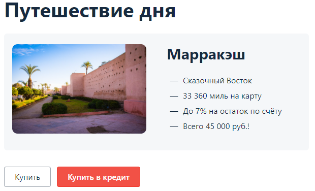

### Дипломный проект профессии «Тестировщик ПО»

#### Описание приложения
Приложение представляет из себя веб-сервис.

Приложение предлагает купить тур по определённой цене с помощью двух способов:
- Обычная оплата по дебетовой карте
- Уникальная технология: выдача кредита по данным банковской карты

Приложение должно в собственной СУБД сохранять информацию о том, каким способом был совершён платёж и успешно ли он был совершён (при этом данные карт сохранять не допускается).

#### Шаги для запуска приложения
1. Открыть проект
1. Выполнить в терминале команду ``Docker-compose up``
1. В отдельном окне терминала выполнить команду ``java -jar ./artifacts/app-shop.jar``
1. Для запуска тестов выполнить команду ``gradlew clean test allureReport``
1. Для генерации отчета о тестировании выполнить команду ``gradlew allureReport``  
Отчет будет находиться в директории: ``./build/reports/allure-report/index.html``

Для тестирования приложения с СУБД PostgreSQL необходимо в файле application.properties в строке ``spring.datasource.url=`` заменить ``jdbc:mysql://localhost:3306/app`` на ``jdbc:postgresql://localhost:5432/app``

#### Документация к проекту
1. [План автоматизации](./documentation/Plan.md)
1. [Отчет по тестированию](./documentation/Report.md)
1. [Отчет по автоматизации](./documentation/Summary.md)

