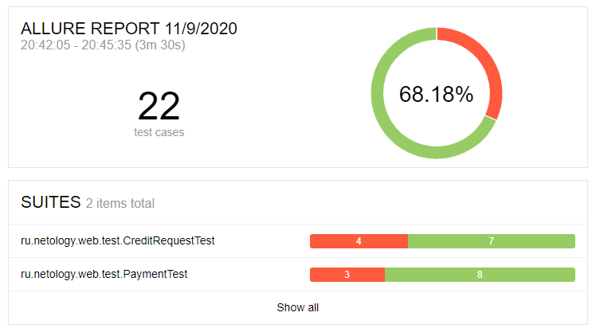
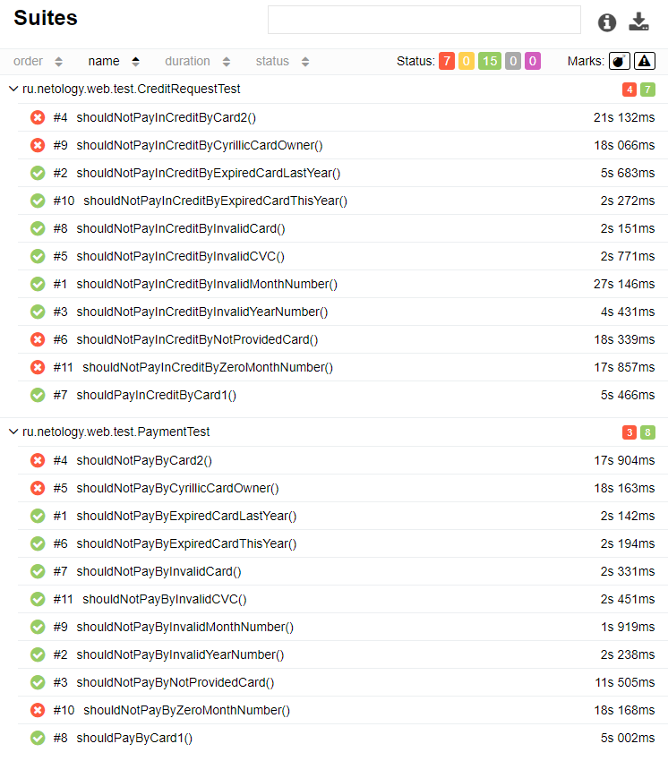

## Отчет по итогам тестирования
В период с 01.11.2020 по 02.11.2020 была произведена настройка тестового окружения.  
Проверена работа симулятора банковских сервисов.  
Проверена заявленная поддержка двух СУБД (MySQL и PostgreSQL).

В период с 05.11.2020 по 09.11.2020 были автоматизированны тестовые сценарии перечисленные в плане автоматизации.  
В результате реализовано автоматическое тестирование покупки тура как по дебетовой карте, так и через запрос на кредит.    
Подключена система автоматической генерации отчетов Allure.

В процессе тестирования были выявлены дефекты.  
Заведены соответствующие [issue](https://github.com/agasferon/AQA_Diploma/issues).

Всего создано 22 авто-теста.
- 15 успешных (68.75 %)
- 7 не удачных (31,25 %)  
  

#### Общие рекомендации:
* Исправить условия появления и исчезновения предупреждений о корректности ввода в поля.
* Исправить появление двух сообщений о результатах заявки.
* Написать контроли для поля "Месяц".
* Исправить проверку срока действия карты в граничных значениях.
* Исправить контроли для поля "Владелец".
* Исправить логику обработки запросов карт со статусом DECLINE.
* Проверить правильность записи запросов на кредит в поля таблицы order_entity.